# ATLAS Architecture

This document provides a comprehensive overview of the ATLAS system architecture, including design principles, component interactions, and implementation details.

## High-Level Architecture

ATLAS follows a modular, layered architecture designed for flexibility, scalability, and extensibility:

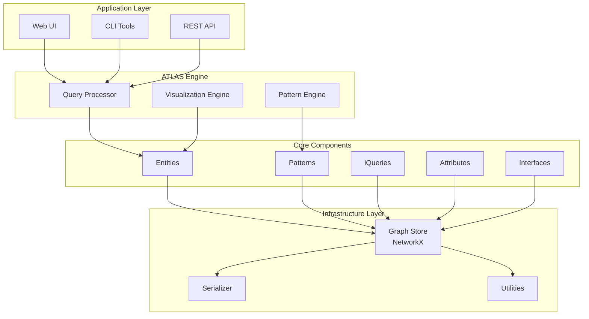

## Design Principles

### 1. Modular Composability

ATLAS is built from loosely coupled, highly cohesive modules that can be:
- **Combined flexibly** to create different system configurations
- **Extended independently** without affecting other components
- **Replaced selectively** for customization or optimization
- **Tested in isolation** for reliability and quality assurance

### 2. Dynamic Typing

Unlike traditional systems with fixed schemas:
- **Entities acquire types dynamically** through pattern assignment
- **Types can change** during system operation based on new information
- **Pattern inheritance** provides structured type hierarchies
- **Type inference** occurs automatically through query participation

### 3. Question-Oriented Design

The system is fundamentally driven by questions rather than data:
- **Queries contain implicit information** about expected answers
- **Missing information generates questions** automatically
- **Questions drive pattern assignment** and type discovery
- **Quality emerges** from systematic questioning processes

### 4. Information Supply Chain

ATLAS treats information flow like a manufacturing supply chain:
- **Suppliers** provide raw information and data
- **Processors** transform and validate information
- **Distributors** route information to appropriate consumers
- **Quality control** ensures information reliability and provenance

## Core Component Architecture

### Entity Management System

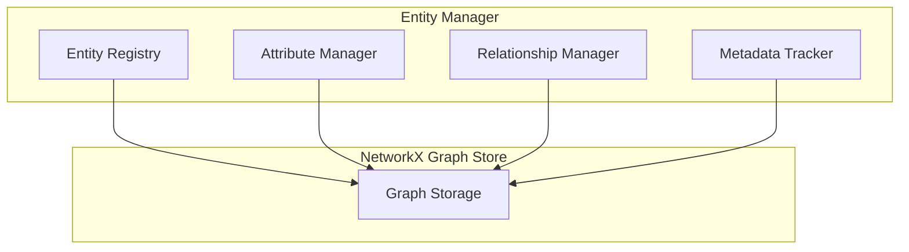

**Key Features:**
- **Flexible schema**: No fixed attribute requirements
- **Relationship tracking**: Manages entity connections and dependencies
- **Metadata management**: Tracks creation, updates, and provenance
- **Quality control**: Anomaly and exception tracking

### Pattern Engine

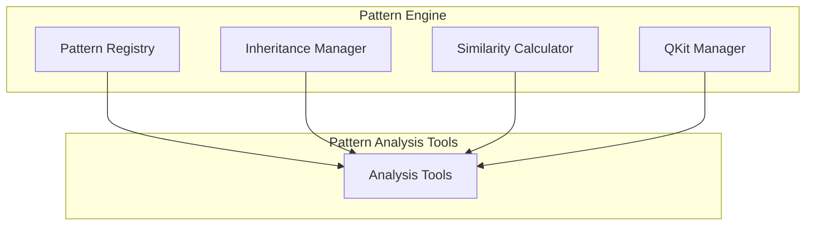

**Key Features:**
- **Hierarchical organization**: Parent-child pattern relationships
- **Similarity analysis**: Pattern comparison and clustering
- **QKit management**: Question generation and organization
- **Effectiveness scoring**: Pattern utility assessment

### Query Processing System

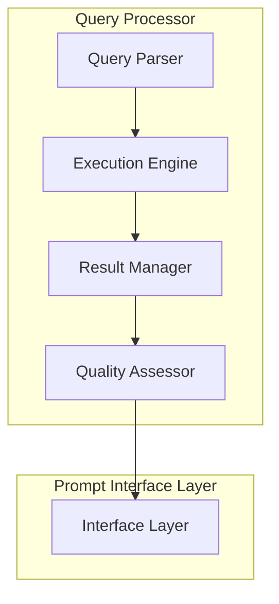

**Key Features:**
- **Query parsing**: Understanding and structuring queries
- **Execution management**: State tracking and result collection
- **Quality assessment**: Confidence and reliability scoring
- **Interface abstraction**: Unified access to diverse data sources

## Data Flow Architecture

### Information Processing Pipeline

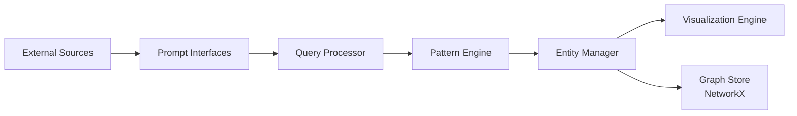

### Query Execution Flow

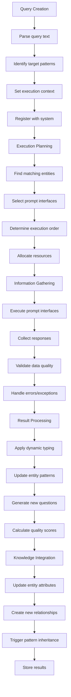

## Storage Architecture

### Graph-Based Storage

ATLAS uses NetworkX directed graphs as the primary storage mechanism:

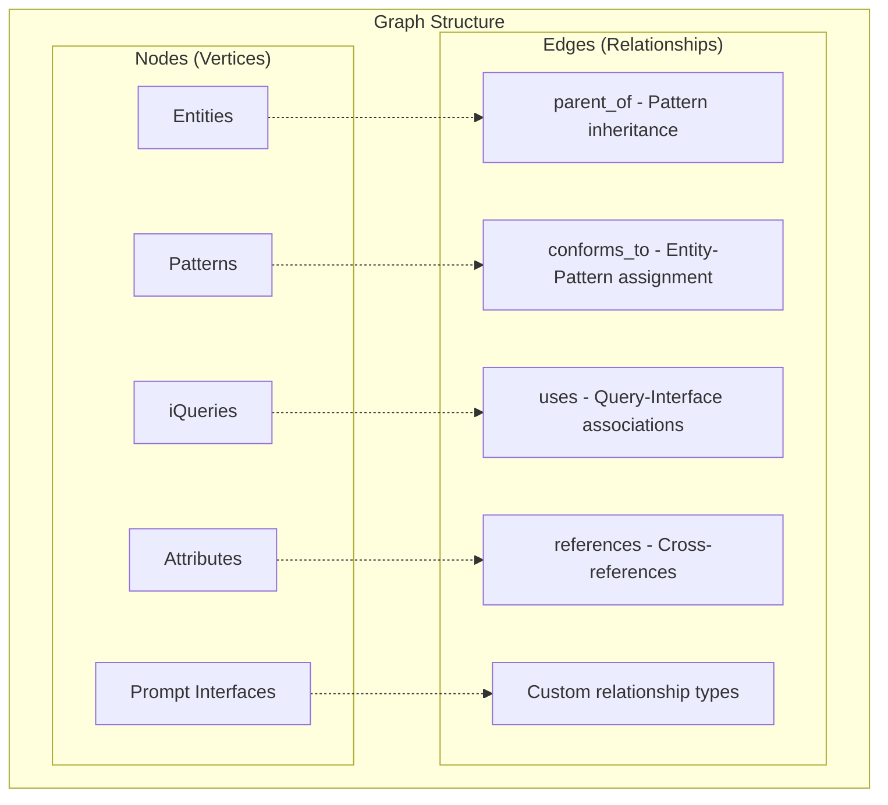

**Benefits:**
- **Flexible schema**: No rigid table structures
- **Relationship-first**: Natural representation of connections
- **Query efficiency**: Graph algorithms for traversal and analysis
- **Visualization ready**: Direct support for network visualization

### Serialization Strategy

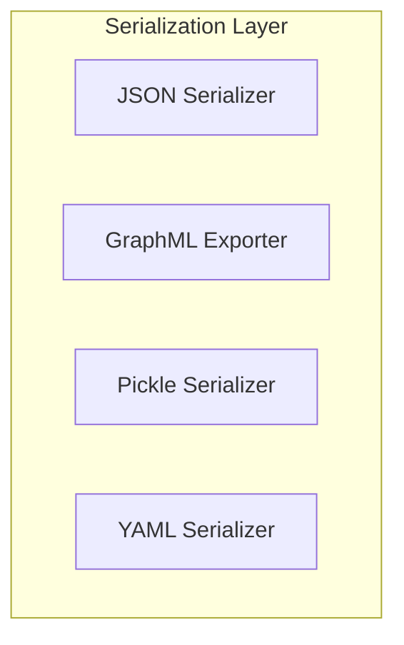

**Formats Supported:**
- **JSON**: Human-readable, web-compatible
- **GraphML**: Standard graph format for analysis tools
- **Pickle**: Python-native, preserves object types
- **YAML**: Configuration and human-readable data

## Interface Architecture

### Prompt Interface System

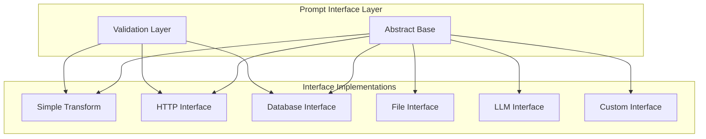

**Interface Types:**
- **SimpleTransformInterface**: Function-based transformations
- **HTTPPromptInterface**: REST API integrations
- **DatabaseInterface**: Direct database connections
- **FileInterface**: File system interactions
- **LLMInterface**: Large Language Model integrations

## Visualization Architecture

### Multi-Layer Visualization System

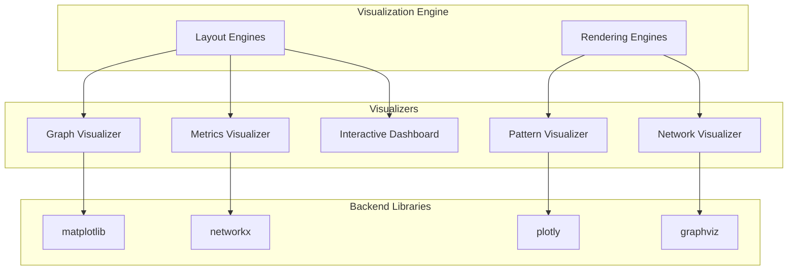

## Scalability Considerations

### Horizontal Scaling

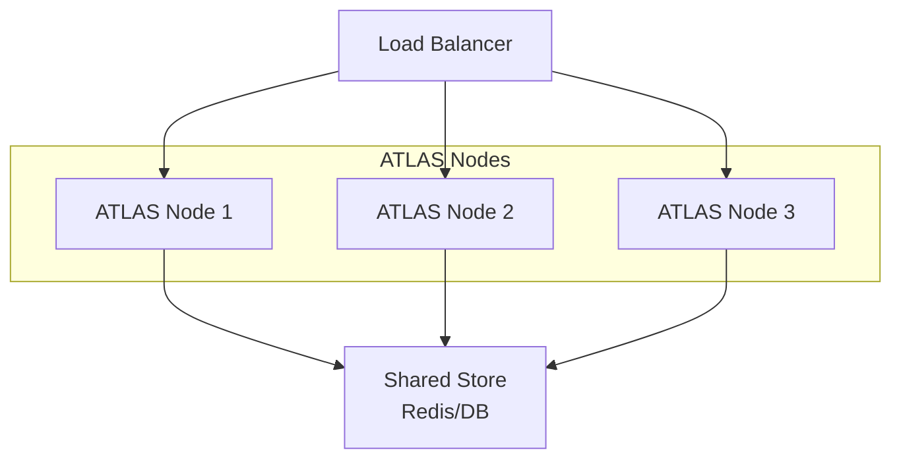

### Vertical Scaling

- **Memory optimization**: Lazy loading and caching strategies
- **CPU optimization**: Parallel processing for pattern analysis
- **Storage optimization**: Incremental persistence and compression
- **Network optimization**: Batch operations and connection pooling

## Security Architecture

### Access Control

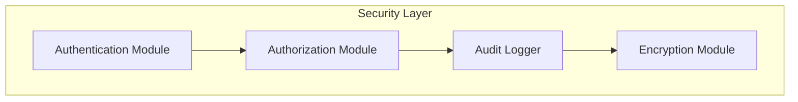

**Security Features:**
- **Authentication**: User identity verification
- **Authorization**: Permission-based access control
- **Audit logging**: Complete operation tracking
- **Data encryption**: At-rest and in-transit protection
- **Privacy controls**: PII detection and anonymization

## Extension Points

### Plugin Architecture

```python
class ATLASPlugin:
    def initialize(self, atlas_engine):
        """Initialize plugin with ATLAS engine access"""
        pass
    
    def register_components(self):
        """Register custom components"""
        pass
    
    def configure_hooks(self):
        """Set up event hooks and callbacks"""
        pass
```

**Extension Areas:**
- **Custom Interfaces**: New prompt interface types
- **Analysis Engines**: Specialized pattern analysis
- **Storage Backends**: Alternative persistence layers
- **Visualization**: Custom chart types and layouts
- **Import/Export**: Additional data format support

## Performance Characteristics

### Time Complexity

| Operation | Best Case | Average Case | Worst Case |
|-----------|-----------|--------------|------------|
| Entity Creation | O(1) | O(1) | O(1) |
| Pattern Assignment | O(1) | O(k) | O(k*p) |
| Query Execution | O(n) | O(n*log(n)) | O(n²) |
| Similarity Calculation | O(1) | O(m) | O(m²) |
| Graph Traversal | O(V+E) | O(V+E) | O(V+E) |

Where:
- n = number of entities
- k = pattern inheritance depth
- p = number of patterns per entity
- m = number of patterns for comparison
- V = vertices, E = edges in graph

### Memory Usage

```python
Component Memory Footprint:
├── Core Graph Structure: O(V + E)
├── Entity Attributes: O(A * S)
├── Pattern Hierarchies: O(P * D)
├── Query Cache: O(Q * R)
└── Visualization Data: O(V + E + L)

Where:
- A = average attributes per entity
- S = average attribute size
- P = number of patterns
- D = average inheritance depth
- Q = cached queries
- R = average results per query
- L = layout algorithm overhead
```

## Development Workflow

### Component Development Cycle

```
1. Design Phase
   ├── Architecture review
   ├── Interface definition
   ├── Performance requirements
   └── Testing strategy

2. Implementation Phase
   ├── Core functionality
   ├── Error handling
   ├── Documentation
   └── Unit tests

3. Integration Phase
   ├── System integration
   ├── Performance testing
   ├── Documentation update
   └── Example creation

4. Deployment Phase
   ├── Release preparation
   ├── Migration scripts
   ├── Monitoring setup
   └── User communication
```

---

*This architecture is designed to be both powerful and flexible, supporting everything from small personal knowledge bases to large-scale enterprise deployments.* 