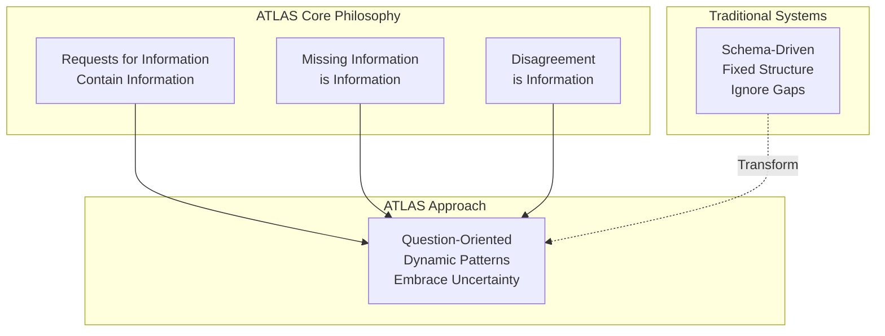
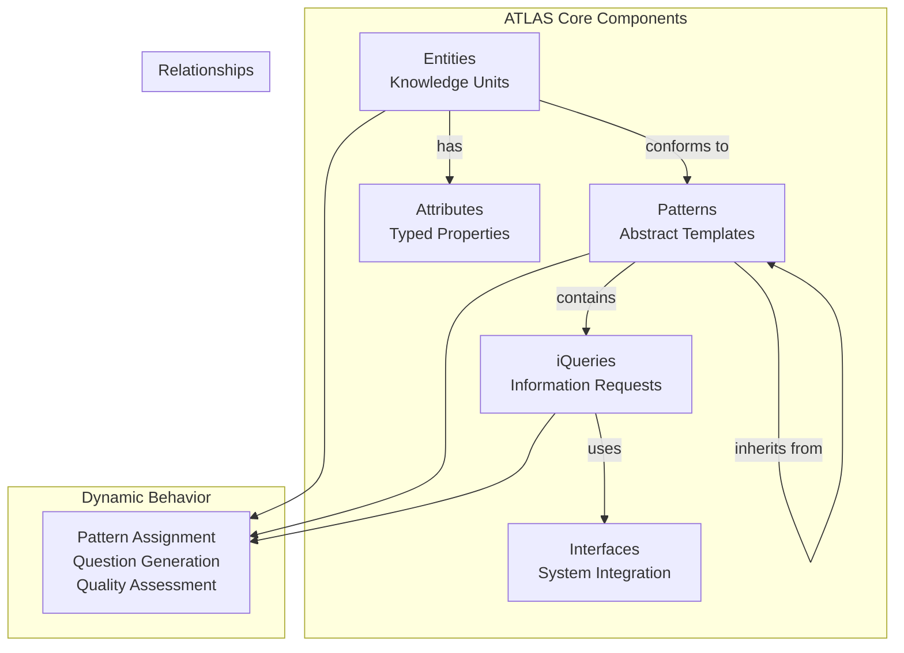

# Basic Concepts

This guide explains the fundamental concepts and principles behind ATLAS, providing the theoretical foundation you need to understand how the system works.

## Core Philosophy

ATLAS is built on three fundamental principles that distinguish it from traditional knowledge management systems:



### 1. A Request for Information Contains Information

When you ask a question, the question itself reveals information about:
- **Your goals and intentions** - What you're trying to accomplish
- **Your current knowledge state** - What you already know and don't know
- **Expected answer types** - What kind of response you're looking for

**Example**: The question "What is the national flag of France?" reveals:
- You're looking for a flag (visual symbol)
- You expect France to have a national flag
- You're interested in national symbols or French culture

### 2. Missing Information is Information

Knowledge gaps aren't just empty spaces - they're valuable data points that tell us:
- Where our knowledge is incomplete
- What questions we should be asking
- Which areas need further investigation
- What assumptions we're making

**Example**: If a database of countries has population data for every country except one, that missing data point suggests either:
- A data collection problem
- An exceptional case (e.g., disputed territory)
- A quality issue requiring attention

### 3. Disagreement Over Information is Information

When different sources provide conflicting information, this disagreement is itself valuable because it indicates:
- Areas of uncertainty or debate
- Different perspectives or contexts
- Potential quality issues
- Evolution of knowledge over time

**Example**: If two sources give different founding dates for a company, this disagreement might indicate:
- Different definitions of "founding" (incorporation vs. first business vs. idea conception)
- Historical complexity or multiple relevant events
- Source reliability differences

## Core Components

ATLAS consists of five interconnected components that work together to create a dynamic knowledge management system:



### Entities

**What they are**: Entities are the fundamental building blocks - anything that can be identified and described.

**Key characteristics**:
- Have unique identifiers
- Contain flexible attributes (key-value pairs)
- Can be assigned to multiple patterns
- Support dynamic typing through pattern assignment

**Examples**:
- A person (with attributes like name, age, profession)
- A document (with attributes like title, author, publication date)
- An abstract concept (with attributes like definition, related concepts)

```python
# Example entity
person = Entity(
    entity_id="marie_curie",
    attributes={
        "name": "Marie Curie",
        "birth_year": 1867,
        "profession": "physicist",
        "nobel_prizes": 2,
        "research_areas": ["radioactivity", "chemistry"]
    },
    patterns=["scientist", "nobel_laureate", "historical_figure"]
)
```

### Patterns

**What they are**: Patterns are templates that define what kinds of information we expect about certain types of entities.

**Key characteristics**:
- Define expected questions (QKit) for entities that conform to them
- Support inheritance hierarchies (parent-child relationships)
- Enable dynamic typing of entities
- Can be shared across different domains

**Components of a Pattern**:
- **QKit**: Set of questions expected to be asked about entities with this pattern
- **Parents**: Patterns this pattern inherits from
- **Children**: Patterns that inherit from this pattern
- **Attributes**: Metadata about the pattern itself

```python
# Example pattern
scientist_pattern = Pattern(
    pattern_id="scientist",
    qkit=[
        "what_is_their_field_of_study",
        "what_are_their_major_discoveries",
        "where_did_they_study",
        "what_awards_have_they_received"
    ],
    parents=["person"],  # Inherits from person pattern
    attributes={
        "domain": "academia",
        "type": "professional_role"
    }
)
```

### iQueries (Itemized Queries)

**What they are**: Structured queries that manage information requests and leverage the latent information in questions.

**Key characteristics**:
- Can be applied to multiple entities sharing patterns
- Automatically generate new questions based on answers
- Support different execution states (pending, executing, completed, failed)
- Enable dynamic typing of response entities

**Execution Flow**:
1. Query targets entities with specific patterns
2. Prompt interfaces gather information
3. Responses are processed and typed
4. New questions may be generated based on response types

```python
# Example iQuery
research_query = iQuery(
    query_id="find_research_collaborations",
    query_text="Who has this scientist collaborated with?",
    target_patterns=["scientist"],
    context={"research_period": "1900-1950"}
)
```

### Attributes

**What they are**: Specialized entities that represent properties or characteristics that can be shared across different systems.

**Key characteristics**:
- Have Reference IDs for cross-system linking
- Support validation rules and type checking
- Track transformation history
- Enable interoperability without shared schemas

**Use cases**:
- Linking data across different databases
- Maintaining attribute definitions and standards
- Tracking data quality and provenance
- Supporting schema evolution

```python
# Example attribute
publication_date = Attribute(
    attribute_id="publication_date",
    ref_id="pub_date_001",
    data_type="date",
    attributes={
        "format": "ISO-8601",
        "timezone": "UTC",
        "validation_rule": "must_be_past_date"
    }
)
```

### Prompt Interfaces

**What they are**: Translation layers that enable data transformation and system interoperability.

**Key characteristics**:
- Abstract away specific implementation details
- Enable communication between different systems
- Support various data transformation methods
- Provide consistent interfaces for external services

**Types**:
- **Simple Transform**: Function-based transformations
- **HTTP Interface**: API-based data exchange
- **Database Interface**: Direct database connections
- **Human Interface**: Surveys, forms, manual input

```python
# Example prompt interface
api_interface = HTTPPromptInterface(
    endpoint_url="https://api.example.com/research",
    method="POST",
    name="Research Database API",
    description="Interface to external research database"
)
```

## Key Mechanisms

### Dynamic Typing

Unlike traditional systems with fixed schemas, ATLAS uses **dynamic typing** where:

1. **Entities acquire types (patterns) based on their participation in queries**
2. **Pattern assignment can change during system operation**
3. **New patterns can emerge from query results**
4. **Type inheritance follows pattern hierarchies**

**Example Flow**:
```
1. Entity "unknown_document" has only basic attributes
2. iQuery asks "What type of document is this?"
3. Response indicates "research paper"
4. Entity automatically gets "research_paper" pattern
5. This triggers new questions from the research_paper QKit
```

### Exponential Expansion Management

ATLAS manages rapid knowledge base growth through:

1. **Structured networking** of existing entities rather than unlimited creation
2. **Pattern-based constraints** that limit irrelevant expansion
3. **Quality thresholds** that filter low-value connections
4. **Hierarchical organization** that maintains navigability

**Growth Pattern**: Initially exponential, then sigmoid as the system matures and begins networking existing entities rather than creating new ones.

### Information Supply Chains

ATLAS treats information flow like a supply chain with:

- **Suppliers**: Data sources and information providers
- **Processors**: Transformation and analysis components
- **Distributors**: Query systems and interfaces
- **Consumers**: End users and applications
- **Quality Assurance**: Validation and verification systems

### Interoperability Without Standards

ATLAS achieves system integration through:

1. **Reference IDs**: Common identifiers that work across different schemas
2. **Prompt Interfaces**: Translation between different data formats
3. **Pattern Mapping**: Identifying equivalent patterns across domains
4. **Flexible Schemas**: No rigid requirements for attribute structure

## Advanced Concepts

### Information Exchange Environments (IXE)

ATLAS instances that support sharing iQuery objects with other systems.

**Requirements**:
- Ability to expose entities/queries for external access
- Mechanisms for splitting and merging entities
- Support for continuous or on-demand data exchange

### Verified Information Exchange Environments (VIE)

IXEs with additional quality assurance and reliability guarantees.

**Additional Requirements**:
- Defined quality assurance standards
- Measurable functional reliability
- Enforcement and remediation procedures
- Clear duties of care for information providers

### Pattern Languages

ATLAS implements Christopher Alexander's pattern language concepts in a digital context:

- **Patterns capture recurring solutions** to common problems
- **Pattern networks** show relationships between different solutions
- **Generative quality** emerges from pattern application
- **Community evolution** allows patterns to develop over time

### Cognitive Security

ATLAS addresses information security through:

- **Provenance tracking**: Know where information comes from
- **Quality scoring**: Assess information reliability
- **Anomaly detection**: Identify unusual patterns or outliers
- **Disagreement analysis**: Understand conflicting information sources

## Mental Models for Understanding ATLAS

### Network Metaphor
Think of ATLAS as a dynamic network where:
- **Nodes** are entities, patterns, and queries
- **Edges** are relationships and information flows
- **Network growth** follows structured patterns
- **Information flows** like data through network connections

### Question-Driven Discovery
ATLAS operates like a research process where:
- **Questions generate more questions** through pattern inheritance
- **Answers reveal new entity types** through dynamic typing
- **Knowledge gaps become explicit** through RFI generation
- **Quality emerges** from systematic questioning

### Living Document Metaphor
ATLAS functions like a collaborative document that:
- **Grows organically** as people contribute information
- **Maintains structure** through pattern organization
- **Links information** across different sections and contexts
- **Evolves over time** as understanding deepens

## Common Misconceptions

### "ATLAS is just another database"
**Reality**: ATLAS is a dynamic knowledge management framework that grows and evolves, unlike static databases with fixed schemas.

### "Patterns are the same as database schemas"
**Reality**: Patterns are more flexible and can change during operation, support inheritance, and generate questions automatically.

### "iQueries are just database queries"
**Reality**: iQueries contain implicit information, generate new questions, and support dynamic typing of results.

### "ATLAS requires shared standards for interoperability"
**Reality**: ATLAS achieves interoperability through Reference IDs and Prompt Interfaces without requiring shared schemas.

## Practical Implications

### For Knowledge Workers
- **Explicit knowledge gaps**: ATLAS makes it clear what you don't know
- **Reduced redundancy**: Automatic linking prevents duplicate work
- **Enhanced discovery**: Pattern-based exploration reveals connections
- **Quality awareness**: Built-in metrics show information reliability

### For Organizations
- **Improved collaboration**: Shared patterns and vocabularies
- **Better decision making**: More complete and connected information
- **Risk management**: Explicit tracking of information quality and gaps
- **Institutional memory**: Persistent knowledge structures that survive personnel changes

### For Researchers
- **Hypothesis generation**: Pattern analysis suggests new research directions
- **Literature integration**: Automatic linking across different domains
- **Collaboration support**: Shared reference systems enable coordination
- **Reproducibility**: Complete provenance tracking for all information

## Next Steps

Now that you understand the core concepts, you're ready to:

1. **[Try the Quick Start Tutorial](quickstart.md)** - Build your first ATLAS system
2. **[Explore the User Guide](../user-guide/index.md)** - Learn detailed operations
3. **[Study the Architecture](../architecture/index.md)** - Understand system design
4. **[Review Examples](../../examples/README.md)** - See ATLAS in action

---

*Understanding these concepts is key to effectively using ATLAS. Take time to internalize these ideas before moving to more advanced topics.* 