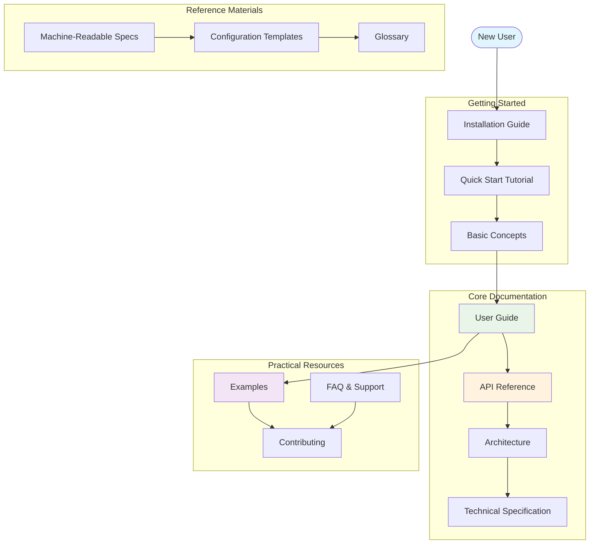

# ATLAS Documentation

Welcome to the comprehensive documentation for ATLAS (Adaptive Thinking and Learning Architecture System) - a dynamic knowledge management framework that addresses the complexities of modern information supply chains.

## Documentation Navigation Map

Understanding how all documentation components connect:

## Quick Start

- [Installation Guide](INSTALL.md) - Get ATLAS up and running
- [Quick Start Tutorial](getting-started/quickstart.md) - Your first ATLAS system in 5 minutes
- [Basic Concepts](getting-started/concepts.md) - Understanding ATLAS fundamentals

## Core Documentation

### User Guides
- [User Guide](user-guide/index.md) - Complete guide for using ATLAS
- [API Reference](api/index.md) - Comprehensive API documentation
- [Entity Management](user-guide/entities.md) - Working with entities and attributes

### Developer Resources
- [Architecture Overview](architecture/index.md) - System architecture and design
- [Contributing Guide](community/contributing.md) - How to contribute to ATLAS
- [Examples](../examples/README.md) - Practical examples and use cases
- [Technical Specification](specification.md) - Complete technical specification

### Machine-Readable Specifications
- [Configuration Schema](schemas/atlas-config.schema.json) - ATLAS configuration validation and IDE support
- [Build Schema](schemas/atlas-build.schema.json) - Build, test, and CI/CD automation configuration
- [Deployment Schema](schemas/atlas-deployment.schema.json) - Container deployment and orchestration
- [OpenAPI Specification](schemas/atlas-api.openapi.yaml) - REST API design and client generation
- [System Metadata](metadata/system-metadata.json) - Complete system capabilities and architecture
- [Configuration Templates](templates/atlas-config.yaml) - Production-ready configuration examples
- [Installation Reference](installation-reference.md) - Canonical installation commands

### Reference Materials
- [Glossary](reference/glossary.md) - Terms and definitions
- [FAQ](reference/faq.md) - Frequently asked questions
- [System Assessment](ATLAS_COMPREHENSIVE_ASSESSMENT.md) - Current system status

## Community

- [Contributing](community/contributing.md) - How to contribute to ATLAS

## About

ATLAS has evolved since the late 1990s from the original Atlas of Risk, integrating pattern language approaches with question-oriented procedures to manage and interpret meaning and context across diverse knowledge domains.

### Key Features

- **Dynamic Pattern Management**: Flexible pattern assignment and inheritance
- **Question-Oriented Discovery**: iQuery system for structured information requests  
- **Modular Architecture**: Composable entities with flexible attributes
- **Cross-Domain Interoperability**: Data exchange without shared standards
- **Cognitive Security**: Built-in information quality and provenance management

### Version Information

- **Current Version**: 1.0.0
- **License**: MIT
- **Python Requirements**: 3.8+

## Quick Navigation

| Topic | Description | Getting Started |
|-------|-------------|-----------------|
| **Entities** | Fundamental objects in ATLAS | [Entity Guide](user-guide/entities.md) |
| **Patterns** | Abstract templates and classifications | [Pattern Guide](api/index.md#pattern) |
| **iQueries** | Structured information requests | [Query Guide](api/index.md#iquery) |
| **Interfaces** | System interoperability layers | [Interface Guide](api/index.md#promptinterface) |
| **Visualization** | Data visualization and analysis | [Visualization Guide](api/index.md#visualization-api) |

## Legacy Documentation

Historical documents and previous system iterations:
- [Legacy System Overview](legacy/ATLAS_SYSTEM_OVERVIEW.md)
- [Legacy Network Implementation](legacy/ATLAS_network.py)
- [Legacy Utils](legacy/ATLAS_utils.py)

---

*For technical questions, please see our [FAQ](reference/faq.md) or [Contributing Guide](community/contributing.md).* 