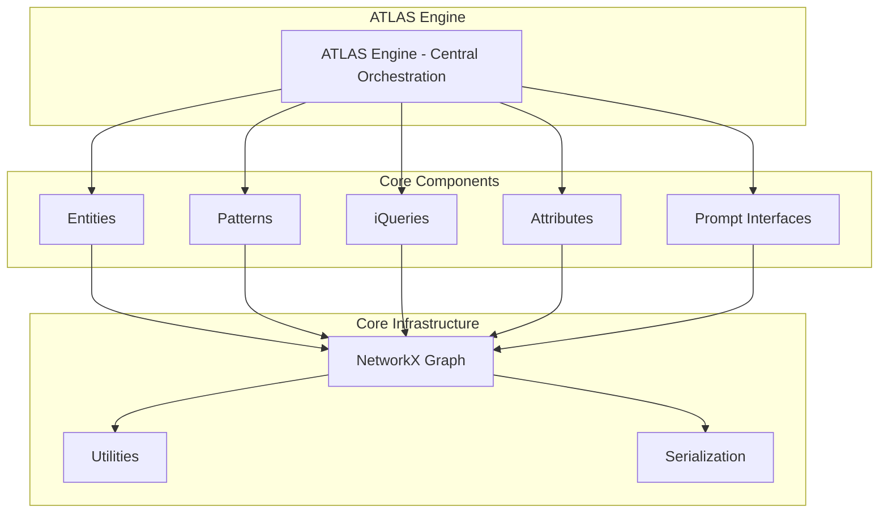

# ATLAS Technical Specification

## Version 1.0.0

## Table of Contents

1. [Introduction](#introduction)
2. [System Architecture](#system-architecture)
3. [Core Components](#core-components)
4. [Design Principles](#design-principles)
5. [Implementation Details](#implementation-details)
6. [API Reference](#api-reference)
7. [Configuration](#configuration)
8. [Extension Points](#extension-points)

## Introduction

ATLAS (Adaptive Thinking and Learning Architecture System) is a dynamic knowledge management framework designed to address the complexities of modern information supply chains. This document provides the technical specification for the ATLAS system implementation.

### Purpose

ATLAS serves as a comprehensive knowledge management system that:

- Enables development and documentation of local and community information standards
- Facilitates rapid expansion and networking of knowledge 
- Provides a foundation for sharing common reference to objects within and between communities
- Reframes intercoder reliability issues as useful information
- Supports synthetic intelligence through stable communication among human and automated agents

### Scope

This specification covers the core ATLAS system components, their interactions, and implementation requirements for both digital prototypes and production deployments.

## System Architecture

ATLAS follows a modular, layered architecture built around five core components:



### Layer Descriptions

1. **ATLAS Engine**: Central orchestration and management layer
2. **Core Components**: Entity, Pattern, iQuery, Attribute, and PromptInterface classes
3. **Infrastructure**: Graph management, utilities, and data persistence
4. **Foundation**: NetworkX graphs, serialization, and helper utilities

## Core Components

### Entity

Entities are the fundamental objects within the ATLAS system.

**Definition**: An Entity E is defined as a tuple E = (A, P) where:
- A: Set of key-value pairs {(k₁, v₁), (k₂, v₂), ..., (kₙ, vₙ)} for flexible attribute assignment
- P: Set of patterns {p₁, p₂, ..., pₘ} that the entity conforms to

**Key Methods**:
- `add_attribute(key, value)`: Add or update entity attributes
- `add_pattern(pattern_id)`: Assign a pattern to the entity
- `mark_anomaly(iquery_id, reason)`: Mark entity as anomalous to a specific iQuery
- `mark_exception(iquery_id, reason)`: Mark entity as exception to a specific iQuery
- `call_rfis()`: Generate requests for information for missing attribute values

### Pattern

Patterns are subclasses of Entity representing abstract phenomena and objects.

**Definition**: A Pattern P is defined as a tuple P = (Q, Parents, Children) where:
- Q: QKit containing references to iQuery objects {q₁, q₂, ..., qₖ}
- Parents: Set of parent patterns {P₁, P₂, ..., Pₚ}
- Children: Set of child patterns {C₁, C₂, ..., Cᶜ}

**Inheritance Rules**:
- Entities assigned to a pattern inherit all parent pattern assignments
- Pattern hierarchies form directed acyclic graphs (DAGs)
- Cycles in pattern inheritance are detected and reported as errors

### iQuery

iQueries manage and facilitate resolution of information requests.

**Definition**: An iQuery I is defined as a tuple I = (RefID, Prompts) where:
- RefID: Reference identifier for managing merge/import/export operations
- Prompts: Set of prompt interface references {p₁, p₂, ..., pᵣ}

**Execution States**:
- PENDING: Query created but not yet started
- EXECUTING: Query currently being processed
- COMPLETED: Query finished successfully
- FAILED: Query encountered an error
- CANCELLED: Query was cancelled before completion

### Attribute

Attributes extend Entity class with reference ID management for cross-system linking.

**Definition**: An Attribute A is defined as a tuple A = (RefID, Attributes, Patterns) where:
- RefID: Unique reference identifier for cross-system linking
- Attributes: Set of key-value metadata pairs
- Patterns: Set of conforming patterns

**Features**:
- Validation rules for value constraints
- Transformation history tracking
- Cross-attribute linking capabilities
- Type inference and validation

### PromptInterface

PromptInterfaces enable data transformation and system interoperability.

**Abstract Methods**:
- `transform(data, context)`: Transform input data according to interface specification
- `validate_input(data)`: Validate input data against schema
- `validate_output(data)`: Validate output data against schema

**Concrete Implementations**:
- `SimpleTransformInterface`: Function-based transformation
- `HTTPPromptInterface`: HTTP endpoint-based transformation

## Design Principles

### Dynamic Typing

ATLAS implements dynamic typing through pattern assignment:

1. **Pattern Inference**: Entities automatically inherit patterns based on iQuery participation
2. **Runtime Assignment**: Patterns can be assigned and removed during system operation
3. **Hierarchical Inheritance**: Child patterns inherit all properties of parent patterns

### Interoperability Without Shared Standards

Key mechanisms:

1. **Reference IDs**: Enable object linking across different ontologies
2. **Prompt Interfaces**: Translate data between different system formats
3. **Flexible Schemas**: No rigid schema requirements for entity attributes
4. **Pattern Mapping**: Similar patterns can be mapped across domains

### Information Supply Chain Management

ATLAS manages information flow through:

1. **Request Routing**: iQueries automatically route to appropriate handlers
2. **Quality Tracking**: Built-in quality and confidence scoring
3. **Provenance Management**: Complete tracking of information sources and transformations
4. **Anomaly Detection**: Automatic identification of outliers and exceptions

## Implementation Details

### Graph Structure

ATLAS uses NetworkX directed graphs for relationship management:

```python
# Node types
- 'entity': Entity instances
- 'pattern': Pattern instances  
- 'query': iQuery instances
- 'attribute': Attribute instances
- 'prompt_interface': PromptInterface instances

# Edge types
- 'parent_of': Pattern inheritance relationships
- 'conforms_to': Entity-pattern assignments
- 'uses': iQuery-PromptInterface associations
- 'references': Cross-references between components
```

### Data Storage

#### In-Memory Storage
- Primary storage in Python dictionaries and NetworkX graphs
- Automatic indexing for fast lookups
- Memory-efficient relationship tracking

#### Persistence Options
- JSON serialization for human-readable storage
- GraphML export for external graph analysis
- Database adapters for scalable persistence

### Performance Considerations

#### Caching
- Pattern hierarchy caching for fast ancestor/descendant queries
- Similarity calculation caching for pattern analysis
- Query result caching for frequently accessed data

#### Optimization
- Lazy loading of large datasets
- Batch operations for bulk updates
- Configurable cache sizes and TTLs

## API Reference

### ATLASEngine

Main orchestration class for the ATLAS system.

```python
class ATLASEngine:
    def __init__(config: Optional[ATLASConfig] = None)
    def add_entity(entity_id: str, entity_data: Dict[str, Any]) -> bool
    def add_pattern(pattern_id: str, pattern_data: Dict[str, Any]) -> bool
    def add_query(query_id: str, query_data: Dict[str, Any]) -> bool
    def query(query_string: str, context: Optional[Dict[str, Any]] = None) -> List[Dict[str, Any]]
    def get_metrics() -> Dict[str, Any]
    def export_graph(format: str = 'graphml') -> str
```

### Entity

```python
class Entity:
    def __init__(entity_id: Optional[str] = None, attributes: Optional[Dict[str, Any]] = None, 
                 patterns: Optional[List[str]] = None, metadata: Optional[EntityMetadata] = None)
    def add_attribute(key: str, value: Any, overwrite: bool = True) -> bool
    def add_pattern(pattern_id: str) -> bool
    def mark_anomaly(iquery_id: str, reason: str = "") -> None
    def call_rfis() -> Set[str]
    def to_dict() -> Dict[str, Any]
```

### Pattern

```python
class Pattern(Entity):
    def __init__(pattern_id: Optional[str] = None, qkit: Optional[List[str]] = None,
                 parents: Optional[List[str]] = None, children: Optional[List[str]] = None, ...)
    def add_qkit_item(iquery_id: str) -> bool
    def add_parent(parent_id: str) -> bool
    def add_child(child_id: str) -> bool
    def calculate_effectiveness_score() -> float
```

## Configuration

### ATLASConfig

```python
@dataclass
class ATLASConfig:
    auto_pattern_inference: bool = True      # Enable automatic pattern assignment
    enable_dynamic_typing: bool = True       # Allow runtime type changes
    max_expansion_depth: int = 10           # Maximum graph traversal depth
    enable_quality_metrics: bool = True      # Calculate quality scores
    log_level: str = "INFO"                 # Logging level
```

### Environment Variables

- `ATLAS_LOG_LEVEL`: Override default logging level
- `ATLAS_CACHE_SIZE`: Set maximum cache size
- `ATLAS_GRAPH_FORMAT`: Default graph export format

## Extension Points

### Custom PromptInterfaces

Implement the abstract `PromptInterface` class:

```python
class CustomInterface(PromptInterface):
    def transform(self, data: Any, context: Optional[Dict[str, Any]] = None) -> Any:
        # Custom transformation logic
        pass
    
    def validate_input(self, data: Any) -> bool:
        # Input validation logic
        pass
    
    def validate_output(self, data: Any) -> bool:
        # Output validation logic
        pass
```

### Pattern Engines

Extend pattern analysis capabilities:

```python
class CustomPatternEngine(PatternEngine):
    def custom_analysis(self) -> Dict[str, Any]:
        # Custom pattern analysis
        pass
```

### Serialization Formats

Add support for new data formats by implementing serialization interfaces.

### Database Backends

Implement persistence adapters for different database systems.

---

This specification provides the foundation for implementing and extending the ATLAS system while maintaining consistency with the theoretical framework and design principles. 