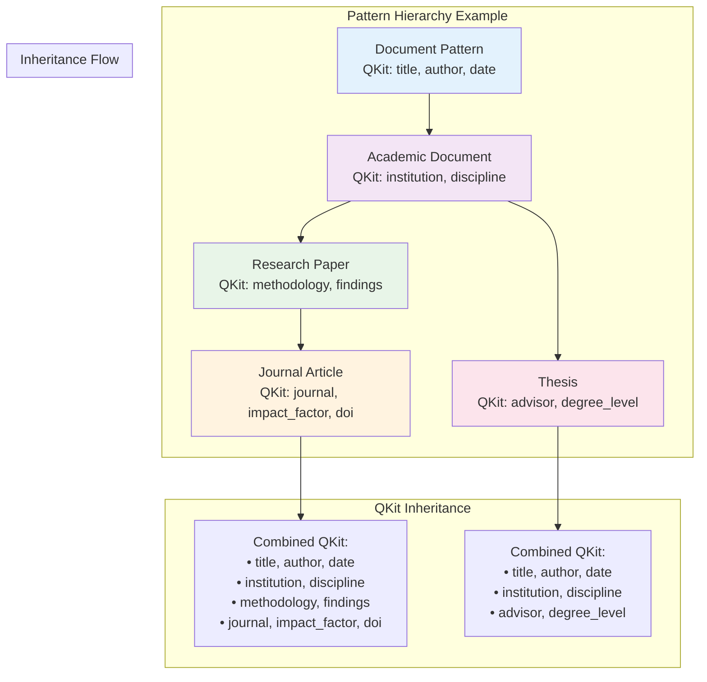

# Pattern Guide

Patterns are one of the core components of ATLAS, serving as abstract templates that define the structure and expectations for different types of entities. This guide covers everything you need to know about creating, managing, and using patterns effectively.

## Pattern Inheritance Visualization

Understanding how pattern inheritance works in ATLAS:



## What Are Patterns?

Patterns in ATLAS are templates that:
- Define expected questions (QKit) for entities that conform to them
- Support inheritance hierarchies for organizing knowledge
- Enable dynamic typing of entities based on their characteristics
- Provide structure for systematic knowledge management

## Creating Patterns {#creating-patterns}

### Basic Pattern Creation

```python
from atlas import Pattern

# Create a simple pattern
research_pattern = Pattern(
    pattern_id="research_paper",
    qkit=[
        "who_are_the_authors",
        "what_is_the_methodology", 
        "what_are_the_findings",
        "when_was_it_published"
    ],
    attributes={
        "domain": "academic_research",
        "type": "document",
        "description": "Academic research publications"
    }
)
```

### Pattern with Inheritance

```python
# Create a specialized pattern that inherits from research_paper
journal_pattern = Pattern(
    pattern_id="journal_article",
    qkit=[
        "what_is_the_journal_name",
        "what_is_the_impact_factor",
        "what_is_the_doi"
    ],
    parents=["research_paper"],  # Inherits all QKit items from research_paper
    attributes={
        "domain": "academic_research",
        "type": "peer_reviewed_document",
        "description": "Peer-reviewed journal articles"
    }
)
```

## QKit Design

The QKit (Question Kit) is the heart of a pattern, defining what information should be systematically collected about entities that conform to the pattern.

### QKit Best Practices

1. **Use Clear, Specific Questions**:
   ```python
   # Good - specific and actionable
   qkit = [
       "what_is_the_publication_date",
       "who_are_the_authors",
       "what_journal_published_this"
   ]
   
   # Avoid - too vague
   qkit = ["metadata", "info", "details"]
   ```

2. **Follow Naming Conventions**:
   - Use lowercase with underscores
   - Start with question words (what, who, when, where, how, why)
   - Be specific about the expected answer type

3. **Organize by Information Type**:
   ```python
   qkit = [
       # Identity questions
       "what_is_the_title",
       "who_are_the_authors",
       
       # Content questions  
       "what_is_the_methodology",
       "what_are_the_findings",
       
       # Publication questions
       "when_was_it_published",
       "where_was_it_published"
   ]
   ```

## Pattern Hierarchies

### Creating Parent-Child Relationships

```python
# Parent pattern
document_pattern = Pattern(
    pattern_id="document",
    qkit=["what_is_the_title", "who_is_the_author", "when_was_it_created"]
)

# Child pattern inherits all parent QKit items
academic_pattern = Pattern(
    pattern_id="academic_document", 
    qkit=["what_is_the_institution", "what_is_the_discipline"],
    parents=["document"]  # Inherits title, author, creation date questions
)

# Grandchild pattern
thesis_pattern = Pattern(
    pattern_id="thesis",
    qkit=["who_is_the_advisor", "what_is_the_degree_level"],
    parents=["academic_document"]  # Inherits from both document and academic_document
)
```

### Managing Pattern Hierarchies

```python
# Add patterns to ATLAS
atlas.add_pattern(document_pattern.id, document_pattern.to_dict())
atlas.add_pattern(academic_pattern.id, academic_pattern.to_dict()) 
atlas.add_pattern(thesis_pattern.id, thesis_pattern.to_dict())

# The thesis pattern now has all QKit items from its ancestry:
# - what_is_the_title (from document)
# - who_is_the_author (from document)  
# - when_was_it_created (from document)
# - what_is_the_institution (from academic_document)
# - what_is_the_discipline (from academic_document)
# - who_is_the_advisor (from thesis)
# - what_is_the_degree_level (from thesis)
```

## Pattern Engine

The PatternEngine provides advanced pattern analysis and management capabilities.

### Setting Up Pattern Engine

```python
from atlas.patterns import PatternEngine

# Create pattern engine
pattern_engine = PatternEngine()

# Add patterns to the engine
pattern_engine.add_pattern(research_pattern)
pattern_engine.add_pattern(journal_pattern)
```

### Pattern Similarity Analysis

```python
# Calculate similarity between patterns
similarity = pattern_engine.calculate_pattern_similarity(
    "research_paper", 
    "journal_article"
)
print(f"Similarity: {similarity:.2f}")

# Find similar patterns
similar_patterns = pattern_engine.find_similar_patterns(
    "research_paper",
    threshold=0.7
)
```

### Pattern Clustering

```python
# Detect pattern clusters based on similarity
clusters = pattern_engine.detect_pattern_clusters(
    similarity_threshold=0.6
)

# Get optimization suggestions
suggestions = pattern_engine.optimize_pattern_hierarchy()
```

## Working with Entities and Patterns

### Assigning Patterns to Entities

```python
from atlas import Entity

# Create entity with pattern assignment
paper = Entity(
    entity_id="smith_2023_ml_survey",
    attributes={
        "title": "Machine Learning Survey 2023",
        "authors": ["Smith, J.", "Jones, A."],
        "publication_date": "2023-06-15",
        "journal": "AI Review"
    },
    patterns=["journal_article"]  # Automatically inherits research_paper pattern too
)

# Add to ATLAS
atlas.add_entity(paper.id, paper.to_dict())
```

### Dynamic Pattern Assignment

```python
# Entities can have patterns added dynamically
paper.add_pattern("highly_cited")  # Add additional pattern based on citation count
paper.add_pattern("survey_paper")  # Add pattern for survey-type papers
```

## Pattern Usage Analytics

### Tracking Pattern Effectiveness

```python
# Get pattern usage statistics
usage_stats = pattern_engine.analyze_pattern_usage()

print(f"Most used pattern: {usage_stats['most_used_pattern']}")
print(f"Average QKit size: {usage_stats['average_qkit_size']}")

# Get effectiveness score for a specific pattern
effectiveness = research_pattern.calculate_effectiveness_score()
print(f"Pattern effectiveness: {effectiveness:.2f}")
```

### Pattern Statistics

```python
# Get detailed pattern statistics
stats = research_pattern.get_statistics()
print(f"QKit size: {stats['qkit_size']}")
print(f"Children count: {stats['children_count']}")
print(f"Instances count: {stats['instances_count']}")
```

## Advanced Pattern Techniques

### Conditional Pattern Assignment

```python
# Use pattern assignment based on entity characteristics
def assign_document_patterns(entity):
    """Intelligently assign patterns based on entity attributes."""
    patterns = ["document"]  # Base pattern
    
    if "peer_reviewed" in entity.attributes and entity.attributes["peer_reviewed"]:
        patterns.append("peer_reviewed_document")
    
    if "journal" in entity.attributes:
        patterns.append("journal_article")
    elif "conference" in entity.attributes:
        patterns.append("conference_paper")
    
    return patterns
```

### Multi-Domain Patterns

```python
# Create patterns that span multiple domains
interdisciplinary_pattern = Pattern(
    pattern_id="interdisciplinary_research",
    qkit=[
        "what_disciplines_are_involved",
        "how_do_domains_interact",
        "what_methodologies_are_combined"
    ],
    parents=["research_paper"],
    attributes={
        "domain": "interdisciplinary",
        "complexity": "high"
    }
)
```

## Best Practices

### Pattern Design Principles

1. **Start Simple**: Begin with basic patterns and add complexity as needed
2. **Use Inheritance**: Leverage parent-child relationships to avoid duplication
3. **Be Consistent**: Use consistent naming and structure across related patterns
4. **Think Hierarchically**: Organize patterns from general to specific
5. **Plan for Growth**: Design patterns that can evolve with your knowledge base

### QKit Design Guidelines

1. **7±2 Rule**: Keep QKit size manageable (5-9 items for human comprehension)
2. **Question Types**: Mix different question types (what, who, when, where, how, why)
3. **Specificity**: Balance specificity with reusability
4. **Completeness**: Cover all essential aspects of the pattern domain

### Performance Considerations

1. **Hierarchy Depth**: Keep inheritance hierarchies reasonably shallow (3-5 levels)
2. **Pattern Count**: Monitor total pattern count for performance
3. **Similarity Calculations**: Use pattern similarity analysis judiciously
4. **Caching**: Leverage pattern engine caching for frequently accessed patterns

## Troubleshooting

### Common Issues

**Pattern Inheritance Not Working**:
- Ensure parent patterns are added to ATLAS before child patterns
- Check for circular dependencies in pattern hierarchies

**Performance Issues with Pattern Analysis**:
- Reduce the number of patterns being analyzed simultaneously
- Use similarity thresholds to limit analysis scope

**QKit Items Not Inherited**:
- Verify parent pattern IDs are correct
- Check that parent patterns exist in the system

### Debugging Pattern Hierarchies

```python
# Debug pattern hierarchy
hierarchy = pattern_engine.get_pattern_hierarchy("journal_article")
print(f"Parents: {hierarchy['parents']}")
print(f"Children: {hierarchy['children']}")
print(f"Ancestors: {hierarchy['ancestors']}")
print(f"Descendants: {hierarchy['descendants']}")
```

## Examples and Use Cases

### Academic Research Domain
- Document → Academic Document → Research Paper → Journal Article
- Document → Academic Document → Thesis → PhD Thesis

### Business Domain  
- Organization → Company → Startup
- Document → Report → Financial Report → Annual Report

### Software Development
- Code → Function → API Endpoint
- Project → Software Project → Open Source Project

## Next Steps

- Learn about [Entity Management](entities.md) to understand how entities use patterns
- Explore the [API Reference](../api/index.md#pattern) for detailed method documentation
- Try the [Quick Start Tutorial](../getting-started/quickstart.md) for hands-on pattern creation
- Review [Examples](../../examples/README.md) for real-world pattern usage

---

*For technical details about Pattern and PatternEngine classes, see the [API Reference](../api/index.md#pattern).*