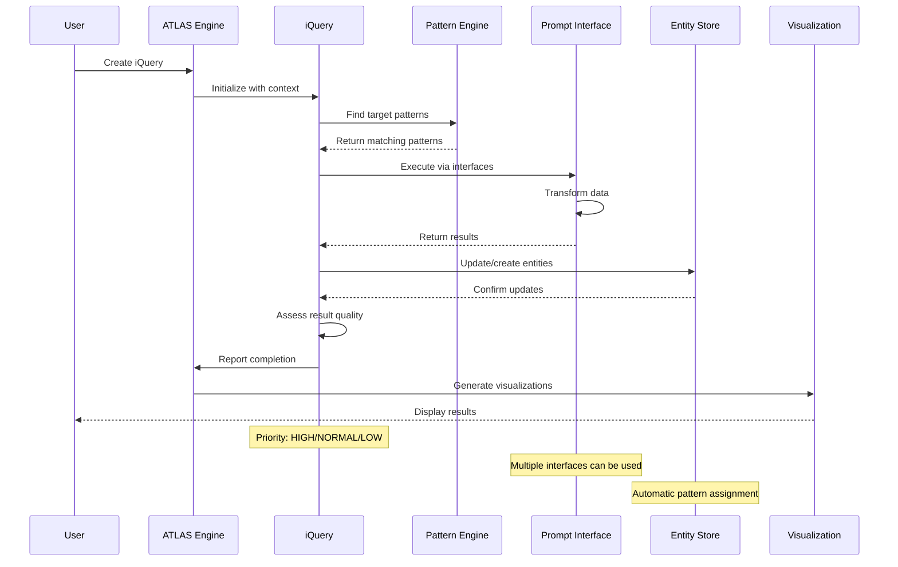

# Query Guide

This guide covers everything you need to know about creating, managing, and executing queries in ATLAS, including the powerful iQuery system for structured information requests.

## What Are Queries?

In ATLAS, queries are structured information requests that enable systematic knowledge discovery and retrieval. The system uses **iQueries** (itemized queries) that transform questions into actionable information requests.

## iQuery System

The iQuery system is the core of ATLAS's question-oriented approach to knowledge management.

### Creating Basic iQueries

```python
from atlas.queries import iQuery, QueryPriority

# Create a simple iQuery
basic_query = iQuery(
    query_id="research_overview",
    query_text="What research has been done on machine learning?",
    priority=QueryPriority.NORMAL
)

# Add to ATLAS system
atlas.add_query(basic_query.id, basic_query.to_dict())
```

### Query Priority Levels

iQueries support different priority levels for execution management:

```python
from atlas.queries import QueryPriority

# Different priority levels
urgent_query = iQuery(
    query_id="critical_analysis",
    query_text="What are the security vulnerabilities?",
    priority=QueryPriority.URGENT
)

high_priority = iQuery(
    query_id="important_research", 
    query_text="What are the latest findings?",
    priority=QueryPriority.HIGH
)

normal_query = iQuery(
    query_id="general_info",
    query_text="What background information is available?",
    priority=QueryPriority.NORMAL
)

low_priority = iQuery(
    query_id="supplementary_data",
    query_text="What additional context exists?", 
    priority=QueryPriority.LOW
)
```

## Query Execution

### Basic Query Execution

```python
# Execute a text-based query
results = atlas.query("machine learning research")

# Execute with context
context = {"domain": "computer_science", "year": "2023"}
results = atlas.query("recent publications", context=context)

# Print results
for result in results:
    print(f"Found: {result}")
```

### Targeted Pattern Queries

```python
# Create query targeting specific patterns
targeted_query = iQuery(
    query_id="pattern_specific",
    query_text="What research papers discuss neural networks?",
    target_patterns=["research_paper", "academic_document"],
    priority=QueryPriority.HIGH
)

atlas.add_query(targeted_query.id, targeted_query.to_dict())
```

### Query with Context

```python
# Create query with rich context
contextual_query = iQuery(
    query_id="contextual_search",
    query_text="What are the applications in healthcare?",
    context={
        "domain": "healthcare",
        "timeframe": "2020-2023", 
        "methodology": "systematic_review",
        "confidence_threshold": 0.8
    }
)
```

## Query Status and Tracking

### Query Status Monitoring

```python
from atlas.queries import QueryStatus

# Check query status
query_status = basic_query.status
print(f"Query status: {query_status}")

# Status options:
# QueryStatus.PENDING - Query created but not executed
# QueryStatus.EXECUTING - Query currently running
# QueryStatus.COMPLETED - Query finished successfully
# QueryStatus.FAILED - Query execution failed
# QueryStatus.CANCELLED - Query was cancelled
```

### Query Progress Tracking

```python
# Update query status
basic_query.update_status(QueryStatus.EXECUTING)

# Add execution metadata
basic_query.add_execution_metadata({
    "start_time": "2023-12-01T10:00:00Z",
    "estimated_duration": 30,
    "resources_required": ["entity_index", "pattern_cache"]
})
```

## Advanced Query Techniques

### Compound Queries

```python
# Create related queries that build on each other
base_query = iQuery(
    query_id="base_research",
    query_text="What research exists on topic X?"
)

follow_up_query = iQuery(
    query_id="methodology_analysis", 
    query_text="What methodologies are used in topic X research?",
    context={"depends_on": "base_research"}
)
```

### Query Refinement

```python
# Refine queries based on initial results
def refine_query(initial_query, initial_results):
    """Refine query based on initial results."""
    if len(initial_results) > 100:
        # Too many results - add specificity
        refined_query = iQuery(
            query_id=f"{initial_query.id}_refined",
            query_text=f"{initial_query.query_text} published after 2020",
            target_patterns=["recent_publication"],
            context={"refinement_of": initial_query.id}
        )
    elif len(initial_results) < 5:
        # Too few results - broaden scope
        refined_query = iQuery(
            query_id=f"{initial_query.id}_broadened",
            query_text=initial_query.query_text.replace("specific_term", "general_term"),
            context={"broadening_of": initial_query.id}
        )
    
    return refined_query
```

### Meta-Queries

```python
# Queries about queries
meta_query = iQuery(
    query_id="query_analysis",
    query_text="What queries have been most effective for this domain?",
    target_patterns=["iquery"],
    context={"meta_analysis": True}
)
```

## Query Best Practices

### 1. Write Clear, Specific Questions

```python
# Good - specific and actionable
good_query = iQuery(
    query_id="ml_healthcare_2023",
    query_text="What machine learning applications in healthcare were published in 2023?",
    target_patterns=["research_paper", "clinical_study"]
)

# Avoid - too vague
vague_query = iQuery(
    query_id="stuff",
    query_text="Find stuff about things"
)
```

### 2. Use Appropriate Priority Levels

```python
# Critical operational queries
urgent = iQuery(
    query_text="What security incidents occurred in the last 24 hours?",
    priority=QueryPriority.URGENT
)

# Regular analysis
normal = iQuery(
    query_text="What are the trends in customer feedback?",
    priority=QueryPriority.NORMAL
)

# Background research
low = iQuery(
    query_text="What historical data is available for context?",
    priority=QueryPriority.LOW
)
```

### 3. Leverage Context Effectively

```python
# Rich context improves results
contextual_query = iQuery(
    query_id="targeted_search",
    query_text="What innovations have emerged?",
    context={
        "timeframe": "last_6_months",
        "domain": "renewable_energy", 
        "geography": "european_union",
        "innovation_type": "technological",
        "maturity_level": "commercial_ready"
    }
)
```

### 4. Target Specific Patterns

```python
# Target relevant patterns for better results
academic_query = iQuery(
    query_text="What peer-reviewed research supports this hypothesis?",
    target_patterns=["peer_reviewed_paper", "systematic_review", "meta_analysis"]
)

business_query = iQuery(
    query_text="What market analysis is available?",
    target_patterns=["market_report", "business_analysis", "industry_study"]
)
```

## Query Performance Optimization

### 1. Use Query Caching

```python
# Enable caching for frequently used queries
repeated_query = iQuery(
    query_id="daily_summary",
    query_text="What happened today?",
    context={"cache_enabled": True, "cache_duration": 3600}  # 1 hour cache
)
```

### 2. Batch Related Queries

```python
# Group related queries for efficient execution
def batch_analysis_queries():
    """Create a batch of related analysis queries."""
    queries = []
    
    base_topics = ["technology", "healthcare", "finance", "education"]
    
    for topic in base_topics:
        query = iQuery(
            query_id=f"{topic}_trends",
            query_text=f"What are the current trends in {topic}?",
            context={"batch_id": "trend_analysis_2023", "topic": topic}
        )
        queries.append(query)
    
    return queries
```

### 3. Set Appropriate Expansion Depth

```python
# Control query depth for performance
shallow_query = iQuery(
    query_text="Quick overview of recent developments",
    context={"max_expansion_depth": 2}  # Faster, less comprehensive
)

deep_query = iQuery(
    query_text="Comprehensive analysis of all related factors",
    context={"max_expansion_depth": 8}  # Thorough, more resource-intensive
)
```

## Working with Query Results

### 1. Processing Results

```python
def process_query_results(results):
    """Process and analyze query results."""
    processed = {
        "total_results": len(results),
        "high_confidence": [],
        "medium_confidence": [],
        "low_confidence": []
    }
    
    for result in results:
        confidence = result.get("confidence", 0.5)
        
        if confidence > 0.8:
            processed["high_confidence"].append(result)
        elif confidence > 0.5:
            processed["medium_confidence"].append(result)
        else:
            processed["low_confidence"].append(result)
    
    return processed
```

### 2. Result Validation

```python
def validate_results(query, results):
    """Validate query results for quality and relevance."""
    validation = {
        "relevance_score": 0,
        "completeness_score": 0,
        "quality_issues": []
    }
    
    # Check result relevance
    query_terms = query.query_text.lower().split()
    relevant_results = 0
    
    for result in results:
        result_text = str(result).lower()
        term_matches = sum(1 for term in query_terms if term in result_text)
        
        if term_matches > len(query_terms) * 0.5:
            relevant_results += 1
    
    validation["relevance_score"] = relevant_results / len(results) if results else 0
    
    return validation
```

## Error Handling and Troubleshooting

### Common Query Issues

1. **No Results Returned**:
   ```python
   # Check if patterns exist
   if not results:
       print("No results found. Check if:")
       print("- Target patterns exist in the system")
       print("- Query terms match entity attributes")
       print("- Expansion depth is sufficient")
   ```

2. **Too Many Results**:
   ```python
   # Refine query with additional filters
   if len(results) > 1000:
       refined_query = iQuery(
           query_id=f"{original_query.id}_filtered",
           query_text=original_query.query_text,
           context={
               **original_query.context,
               "date_filter": "recent",
               "quality_threshold": 0.8
           }
       )
   ```

3. **Performance Issues**:
   ```python
   # Optimize for performance
   optimized_query = iQuery(
       query_text=query_text,
       context={
           "max_expansion_depth": 3,  # Reduce depth
           "batch_size": 50,          # Process in smaller batches
           "parallel_execution": True  # Enable parallel processing
       }
   )
   ```

## Integration with Other Components

### Query-Pattern Integration

```python
# Use queries to discover pattern effectiveness
pattern_analysis_query = iQuery(
    query_id="pattern_effectiveness",
    query_text="Which patterns yield the most useful results?",
    target_patterns=["pattern"],
    context={"analysis_type": "meta"}
)
```

### Query-Entity Workflows

```python
# Create entities based on query results
def create_entities_from_query(query_results):
    """Create new entities from query results."""
    new_entities = []
    
    for result in query_results:
        if result.get("confidence", 0) > 0.9:
            entity = Entity(
                entity_id=generate_id(),
                attributes={
                    "source": "query_result",
                    "query_id": result.get("query_id"),
                    "content": result.get("content"),
                    "confidence": result.get("confidence")
                },
                patterns=["derived_entity"]
            )
            new_entities.append(entity)
    
    return new_entities
```

## Query Templates

### Research Domain Queries

```python
def create_research_queries(topic, timeframe="recent"):
    """Create standard research queries for a topic."""
    return [
        iQuery(
            query_id=f"{topic}_overview",
            query_text=f"What research has been conducted on {topic}?",
            target_patterns=["research_paper", "review_article"]
        ),
        iQuery(
            query_id=f"{topic}_methodology",
            query_text=f"What methodologies are used in {topic} research?",
            target_patterns=["methodology", "experimental_design"]
        ),
        iQuery(
            query_id=f"{topic}_gaps",
            query_text=f"What research gaps exist in {topic}?",
            target_patterns=["research_gap", "future_work"]
        )
    ]
```

### Business Intelligence Queries

```python
def create_business_queries(domain):
    """Create business intelligence queries."""
    return [
        iQuery(
            query_id=f"{domain}_market_trends",
            query_text=f"What are the current market trends in {domain}?",
            target_patterns=["market_analysis", "trend_report"]
        ),
        iQuery(
            query_id=f"{domain}_competitors",
            query_text=f"Who are the key competitors in {domain}?",
            target_patterns=["competitor_analysis", "market_player"]
        ),
        iQuery(
            query_id=f"{domain}_opportunities",
            query_text=f"What opportunities exist in {domain}?",
            target_patterns=["business_opportunity", "market_gap"]
        )
    ]
```

## Next Steps

- Learn about [Entity Management](entities.md) to understand query targets
- Explore [Pattern Design](patterns.md) for better query targeting
- Review the [API Reference](../api/index.md#iquery) for technical details
- Try the [Examples](../../examples/README.md) for practical query usage

---

*For technical details about iQuery classes and methods, see the [API Reference](../api/index.md#iquery).*

## iQuery Execution Flow

Understanding how iQueries are processed and executed in ATLAS:



## What Are iQueries? 