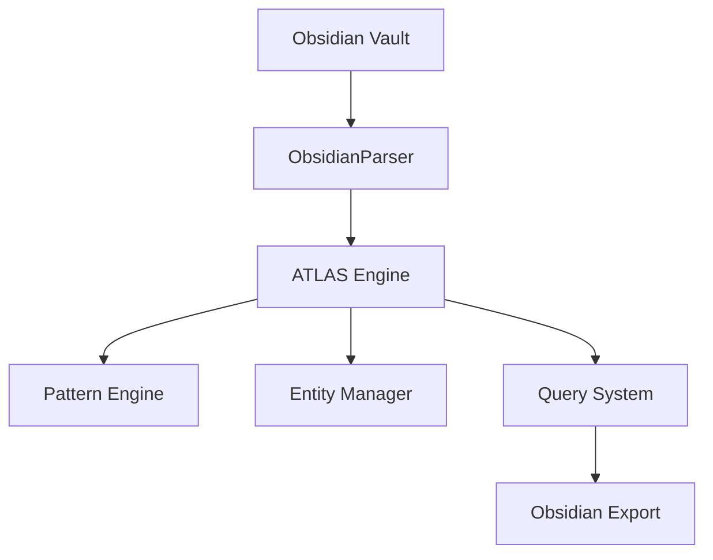

# ATLAS Integration Project

Working on integrating Obsidian with the ATLAS knowledge management system.

## Project Goals

1. **Import Capability**: Read Obsidian vaults into ATLAS
   - Parse markdown files with [[wiki-links]]
   - Extract tags and metadata
   - Handle YAML frontmatter
   
2. **Export Capability**: Export ATLAS data to Obsidian format
   - Convert entities to markdown notes
   - Create proper wiki-link connections
   - Generate index notes

3. **Bidirectional Sync**: Keep Obsidian and ATLAS in sync
   - Detect changes in both systems
   - Resolve conflicts intelligently
   - Maintain data integrity

## Technical Architecture

## Progress

- [x] Basic parsing of markdown files
- [x] Wiki-link extraction
- [x] Tag processing
- [x] YAML frontmatter support
- [ ] Attachment handling
- [ ] Template processing
- [ ] Conflict resolution

## Related Notes

- [[01 - Areas/Software Development]]
- [[Python Best Practices]]
- [[API Design Patterns]]

## Resources

- [[02 - Resources/ATLAS Documentation]]
- [[02 - Resources/Obsidian API Reference]]