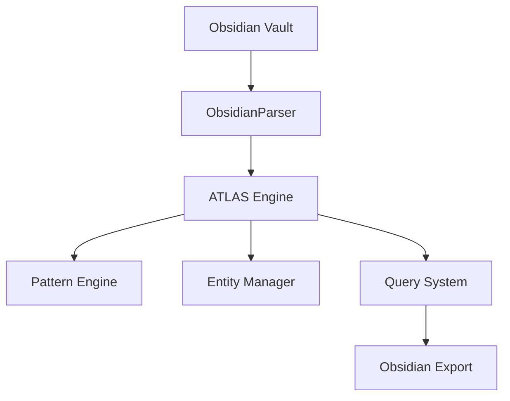

# ATLAS Integration

# ATLAS Integration Project

Working on integrating Obsidian with the ATLAS knowledge management system.

## Project Goals

1. **Import Capability**: Read Obsidian vaults into ATLAS
   - Parse markdown files with [[wiki-links]]
   - Extract tags and metadata
   - Handle YAML frontmatter
   
2. **Export Capability**: Export ATLAS data to Obsidian format
   - Convert entities to markdown notes
   - Create proper wiki-link connections
   - Generate index notes

3. **Bidirectional Sync**: Keep Obsidian and ATLAS in sync
   - Detect changes in both systems
   - Resolve conflicts intelligently
   - Maintain data integrity

## Technical Architecture

## Progress

- [x] Basic parsing of markdown files
- [x] Wiki-link extraction
- [x] Tag processing
- [x] YAML frontmatter support
- [ ] Attach...

## Metadata

- **file_path**: demo_obsidian_vault/03 - Projects/ATLAS Integration.md
- **source**: obsidian
- **wiki_links**: ['02 - Resources/ATLAS Documentation', 'Python Best Practices', '02 - Resources/Obsidian API Reference', 'API Design Patterns', 'wiki-links', '01 - Areas/Software Development']
- **created_date**: 2025-06-02T08:54:53.015762
- **modified_date**: 2025-06-02T08:54:53.015762
- **content_length**: 1276
- **has_frontmatter**: True
- **fm_status**: active
- **fm_start_date**: 2024-01-01

## Related Patterns

- [[obsidian_tag_projects]]
- [[obsidian_tag_atlas]]
- [[obsidian_tag_current]]
- [[obsidian_tag_integration]]

## Relationships

- **References**: [[Python Best Practices]]
- **References**: [[Python Best Practices]]
